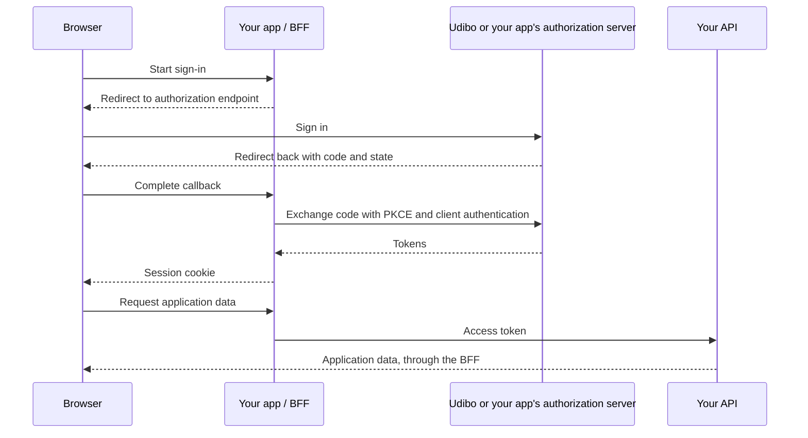

# @udibo/oauth2

OAuth2 and OpenID Connect tools for TypeScript applications. Connect your app to
Udibo's identity service, or host an authorization server for your own app. The
package includes clients, authorization and resource servers, Hono middleware,
React bindings, and optional login flows over your own database.

**Udibo's managed identity service is in private beta.**
[Join the waitlist](https://udibo.com). The self-hosted examples run locally
without a hosted account.

## Choose your path

| Your application needs                      | Start here                                                                                                                |
| ------------------------------------------- | ------------------------------------------------------------------------------------------------------------------------- |
| Udibo to handle sign-in                     | [Use Udibo's identity service](docs/guides/use-udibo.md) — private-beta access required                                   |
| Its own login and authorization server      | [Run the quickstart](docs/quickstart.md), then [host authorization for your app](docs/guides/become-an-oauth-provider.md) |
| An API that accepts access tokens           | [Protect an API](docs/guides/protect-an-api.md)                                                                           |
| A React application with server-held tokens | [Juniper starter](templates/juniper/README.md) or [React Router starter](templates/react-router/README.md)                |

[Documentation index](docs/index.md) ·
[API reference](https://jsr.io/@udibo/oauth2/doc) · [Examples](#examples) ·
[Agent documentation](#for-coding-agents)

## Install

Requires Deno 2 for the development workflow:

```sh
deno add jsr:@udibo/oauth2@0.1.0
```

Import the part you use; there is no root barrel or default export:

```ts
import { BffClient, DirectClient } from "@udibo/oauth2/client";
import { HonoBff } from "@udibo/oauth2/hono/bff";
import { HonoResourceServer } from "@udibo/oauth2/hono/resource-server";
```

Version `0.1.0` is a pre-1.0 API. Minor releases may contain breaking changes;
review the [stability policy](docs/stability.md) before upgrading.

## How the pieces fit

For a browser app, use a backend-for-frontend (BFF). The browser holds an
HttpOnly session cookie; the BFF exchanges authorization codes and keeps access
and refresh tokens on the server. `BffClient` connects the browser to the BFF,
and the React adapter uses that same client.



`DirectClient` is for a process that holds tokens: your backend, a CLI, a native
app, or a public browser client. Supply a client secret only on the server. For
a browser app with a backend, start with the BFF guide.

`HonoResourceServer` validates access tokens and enforces scopes on API routes.
`HonoAuthorizationServer` issues tokens when your app hosts its own
authorization server. The framework-independent core accepts standard `Request`
and `Response` objects; Hono adapters add routing and middleware.

## Examples

From a checkout of this repository:

```sh
deno ci
deno task serve:app-with-own-auth
```

Open <http://localhost:8001/> and sign in as `user` / `password`. The
[quickstart](docs/quickstart.md) explains what to try and which files to read.
All demo credentials, in-memory stores, and local HTTP settings are for
development.

| Example                                                                         | Demonstrates                                                    |
| ------------------------------------------------------------------------------- | --------------------------------------------------------------- |
| [Hono with own auth](examples/hono/app-with-own-auth/README.md)                 | App login, OAuth2 server, BFF, and protected API in one process |
| [Hono with external auth](examples/hono/app-with-external-auth/README.md)       | Delegated sign-in, token introspection, and a BFF proxy         |
| [Standalone API](examples/hono/api-service/README.md)                           | Bearer-token validation without a frontend                      |
| [Juniper with own auth](examples/juniper/app-with-own-auth/README.md)           | Server-rendered React with application-owned login              |
| [Juniper with external auth](examples/juniper/app-with-external-auth/README.md) | Server-rendered React with delegated sign-in                    |

## Package entrypoints

All paths below start with `@udibo/oauth2`. Each entrypoint has typed API docs
and examples in the [reference](https://jsr.io/@udibo/oauth2/doc).

| Subpath                      | Purpose                                                                                         |
| ---------------------------- | ----------------------------------------------------------------------------------------------- |
| `/client`                    | `BffClient`, `DirectClient`, token storage, discovery caching                                   |
| `/server`                    | Shared models, errors, scope types, and service contracts                                       |
| `/server/authorization`      | Authorization server, grants, token/code services, signing keys                                 |
| `/server/resource`           | Resource server, introspection and JWKS token readers                                           |
| `/server/public-suffix`      | Public Suffix List checks for optional wildcard redirect registration                           |
| `/hono/authorization-server` | Hono authorization endpoints                                                                    |
| `/hono/resource-server`      | Bearer authentication and scope middleware                                                      |
| `/hono/bff`                  | BFF routes, server-held tokens, session and pending-login stores                                |
| `/identity`                  | App-owned signup, login, password reset, email verification, passwordless, and protection hooks |
| `/identity/mfa`              | TOTP, recovery codes, and MFA storage contract                                                  |
| `/identity/external`         | Social and external OIDC sign-in for your own login pages                                       |
| `/identity/migration`        | Verify imported password hashes and upgrade them at login                                       |
| `/hono/identity`             | Hono routes for `IdentityService`                                                               |
| `/hono/log`                  | Request logger and URL helper that redact every query value                                     |
| `/react`                     | Context, hooks, authentication guards, and callback handling                                    |
| `/react/components`          | Optional forms for login, signup, password reset, and MFA                                       |
| `/crypto`                    | Random tokens, hashing, encoding, authenticated encryption                                      |
| `/url`                       | Safe return paths and login continuation                                                        |
| `/cli`                       | Local test identity provider and OIDC signing-key generation                                    |
| `/testing`                   | In-memory fixtures and authorization-server test helpers                                        |
| `/testing/contract`          | Tests for app-owned service and storage implementations                                         |
| `/hono/bff/testing`          | BFF session fixtures and session-store contract tests                                           |
| `/react/testing`             | Mock clients and providers for component tests                                                  |

## Runtime support

The library uses Web APIs. The complete suite runs on Deno. CI also builds an
npm-format compatibility artifact and verifies 20 entrypoints with TypeScript
and Node; this does not publish an npm package.

| Surface                                     | Deno                  | Node                     | Browser                                     | Bun           |
| ------------------------------------------- | --------------------- | ------------------------ | ------------------------------------------- | ------------- |
| Clients and React                           | Tested, including SSR | Import/type smoke-tested | Intended for client code; no secrets        | Not verified  |
| Server, identity, Hono, crypto, URL helpers | Tested                | Import/type smoke-tested | Server functionality belongs on the backend | Not verified  |
| `/hono/bff/testing`, `/react/testing`       | Tested                | Import/type smoke-tested | React test helpers only                     | Not verified  |
| `/testing`, `/testing/contract`             | Tested                | Not verified             | Not supported                               | Not verified  |
| `/cli`                                      | Deno only             | Not supported            | Not supported                               | Not supported |

See [stability](docs/stability.md#runtime-support) for the support boundary.

## Before deploying

Use the [application deployment guide](docs/guides/production-deployment.md) and
[deployment checklist](docs/guides/hardening-checklist.md). Keep PKCE, state,
confidential-client authentication, and CSRF checks enabled. Replace development
stores with persistent implementations where needed, and run the exported
contract tests against those implementations.

Read [known limitations](docs/known-limitations.md) for token-revocation,
cookie-session, OIDC, and optional-protection behavior. Identity feature
examples apply to apps hosting their own login; Udibo clients use the hosted
sign-in flow.

## For coding agents

Start with [llms.txt](llms.txt) for the task-to-guide map and integration rules.
Use [llms-full.txt](llms-full.txt) when a single documentation download is
useful. It is generated from the same guides developers read. Prefer the
exported types and [extension reference](docs/trigger-points.md) when
implementing a custom store or callback.

## Contributing and security

Run `deno task check` and `deno task test:all` before proposing changes. See
[CONTRIBUTING.md](CONTRIBUTING.md) for development conventions,
[SECURITY.md](SECURITY.md) for private vulnerability reports, and
[CHANGELOG.md](CHANGELOG.md) for release history.
